# Сервис "SdaemBy". Аренда недвижимости в России.

SPA приложение с клиент-серверной архитектурой.

1. Разработал Авторизацию/Регистрацию, JWT.
2. Личный кабинет пользователя(забронированные номера,
   избранное) с возможностью редактирования.
3. Панель администратора (Таблица незабронированных товаров, отмена бронирования, )
4. Страница с доступными номера ( Поиск, Сортировка, Фильтрация,
   Пагинация).
5. Страница номера ( Возможность забронировать номер, оставить отзыв,
   система лайков, рейтинг номера).

# Админ Login/Password: admin@gmail.ru, Test1234

# deploy: http://45.8.249.147/

# Запуск проекта локально(временное решение)

```
cd client -> npm start
cd server -> npm run serve
change apiEndPoint -> client/config.json = {"apiEndPoint": "http://localhost:8080/api"}
```

# Стек технологий

-   React, Typescript
-   React-Redux, Redux Toolkit
-   SASS, SCSS
-   NodeJS, Express, MongoDB
-   Docker

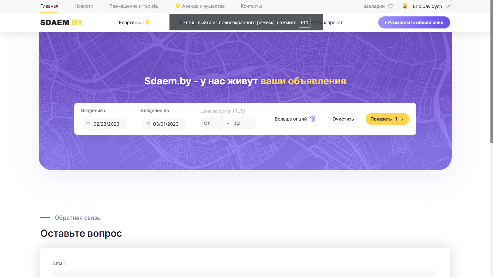

# Реализовано

-   Авторизация и регистрация

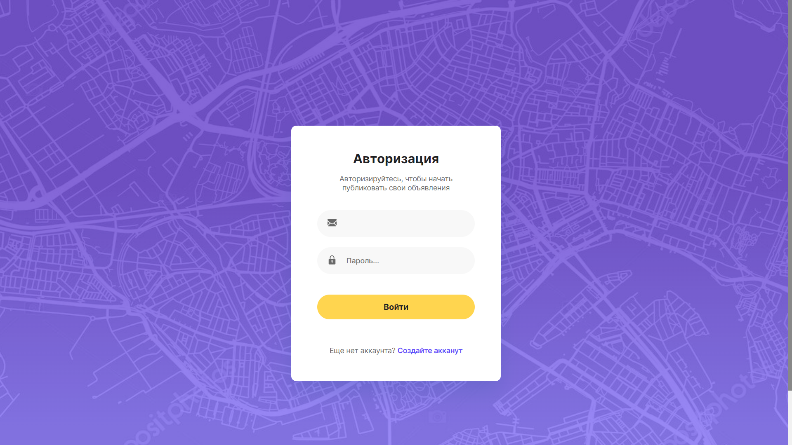
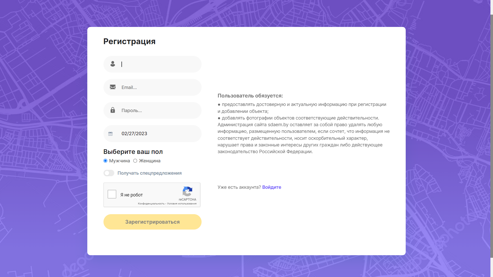

-   Страница с доступными товарами ( Поиск, Сортировка, Фильтрация,Пагинация/Постраничный вывдо)

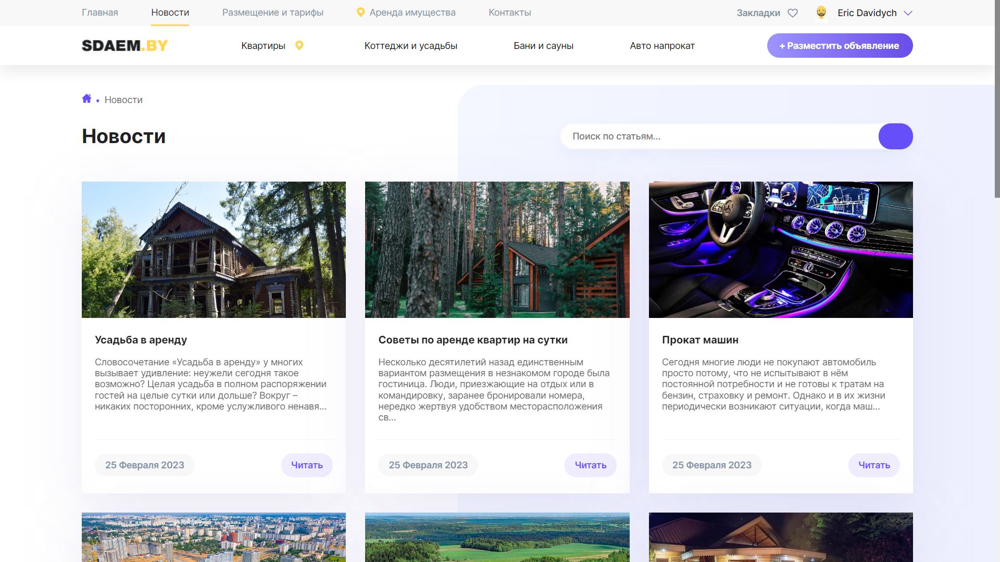
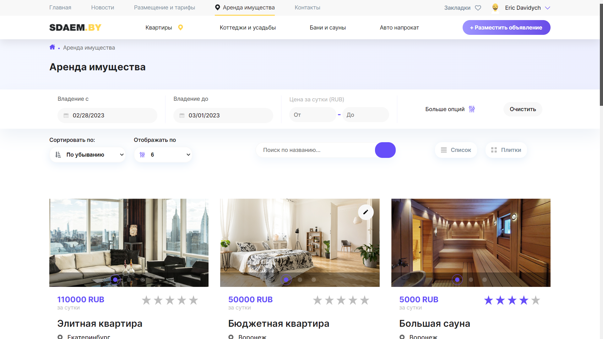

-   Страница товара (Забронировать, добавить в избранное, оставить отзыв могут только авторизованные пользователи)

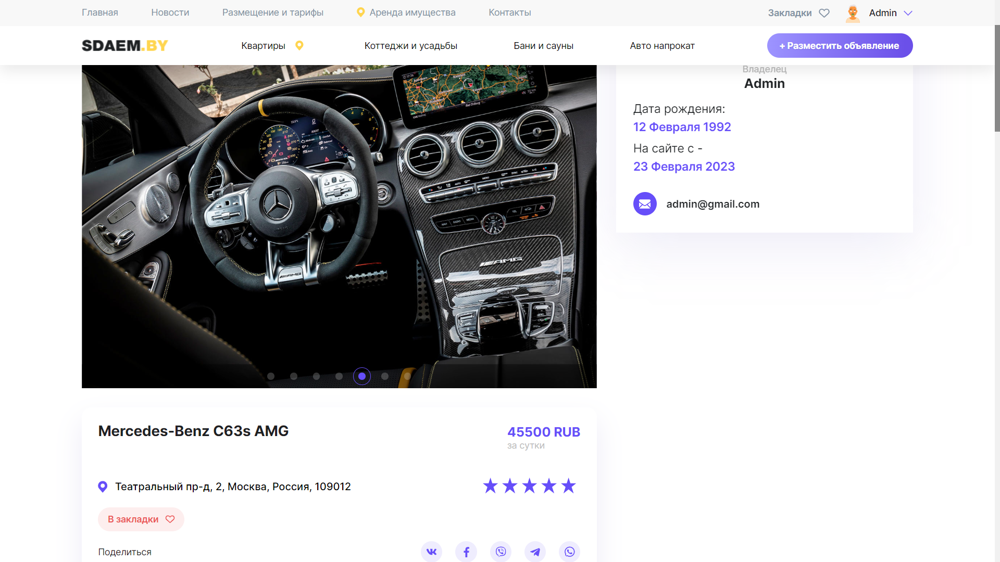

-   Меню и страница пользователя

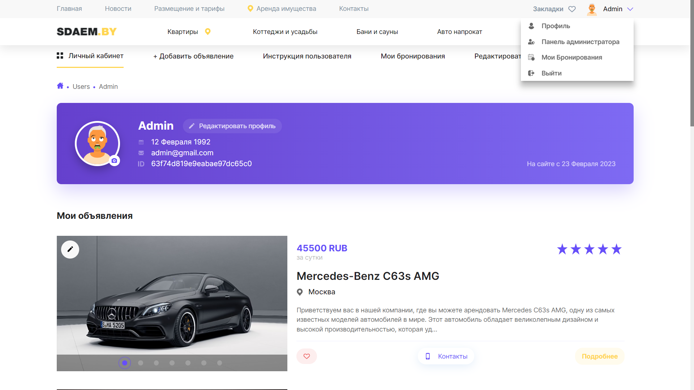

-   Панель администратора

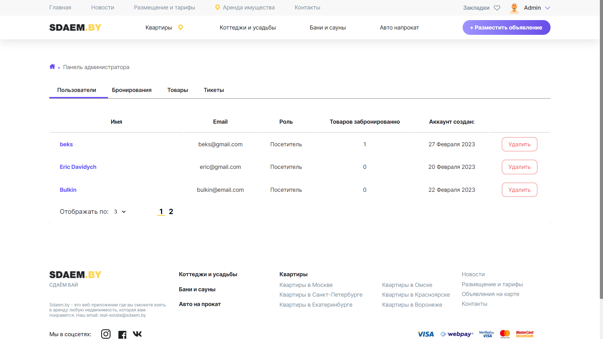

-   Панель администратора(Список бронирований для каждого номера, отмена бронирования, страница пользователя, кто забронировал номер).

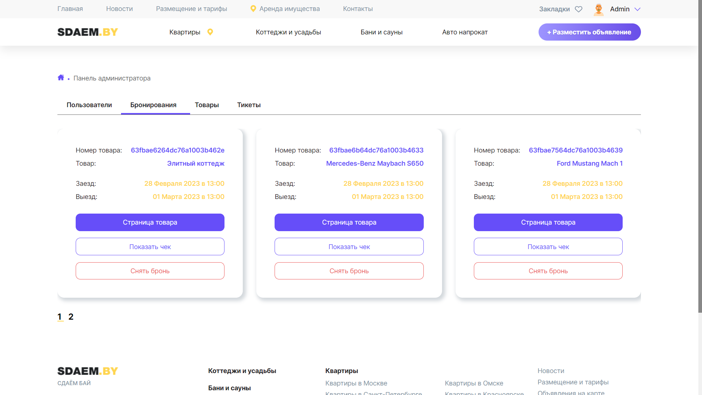
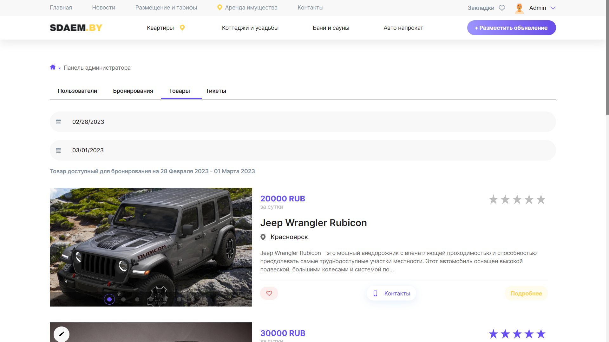
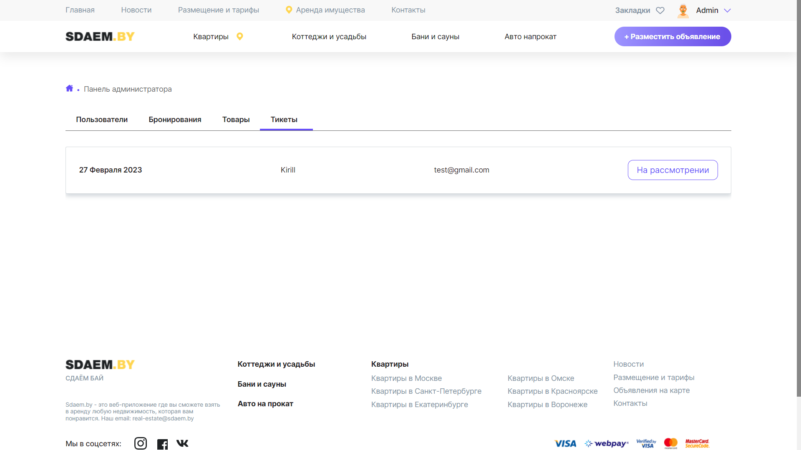

-   Страница редактирования пользователя

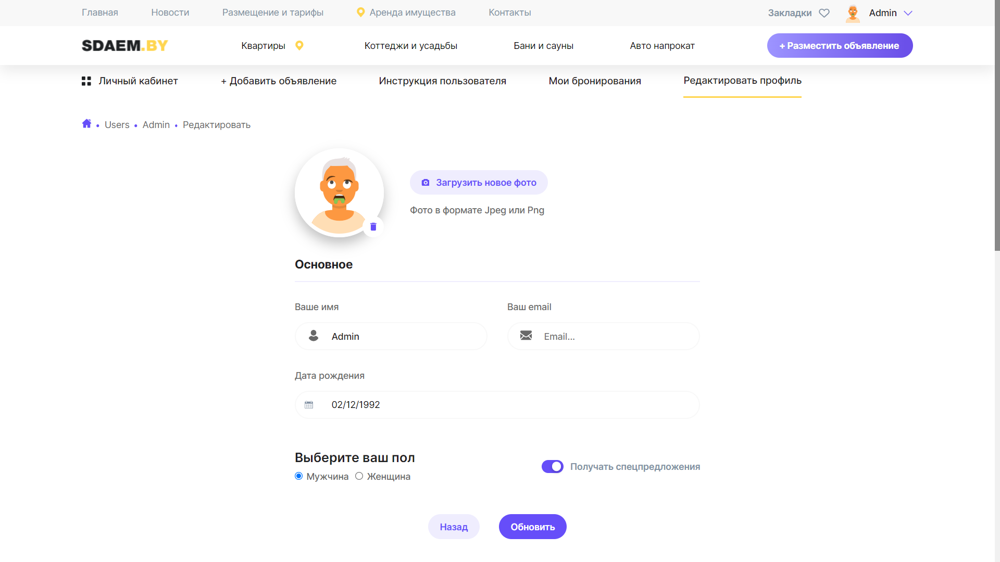

-   Возможность оставить отзыв для номера, система лайков, рейтинг.

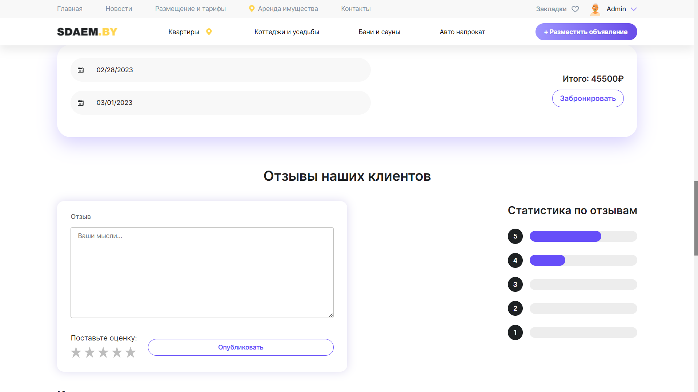

-   Страница редактирования номера( only user role is Admin )

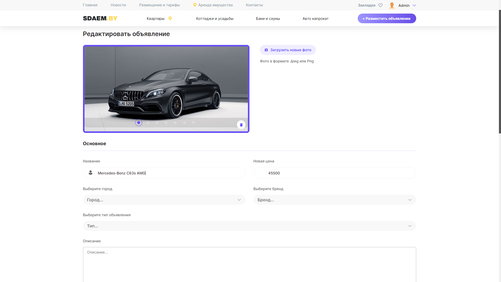

-   Страницы: Мои Бронирования, Закладки.

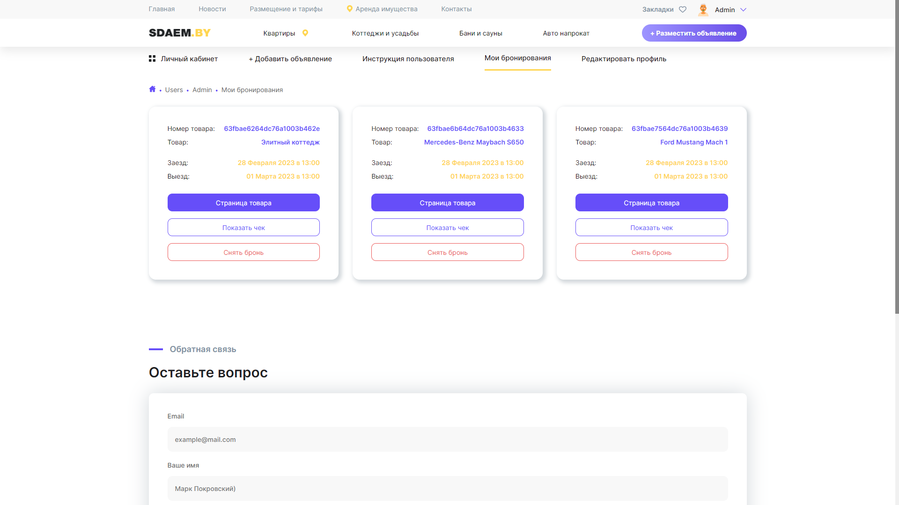
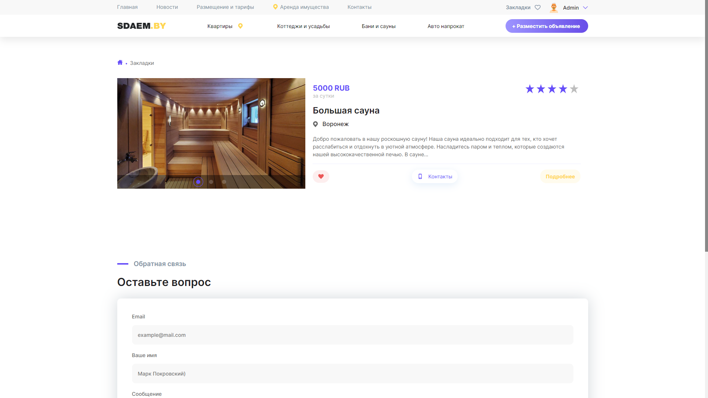
